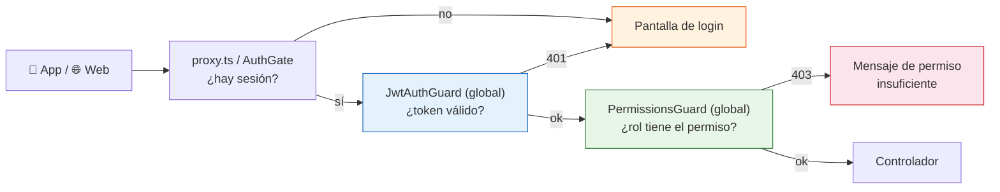
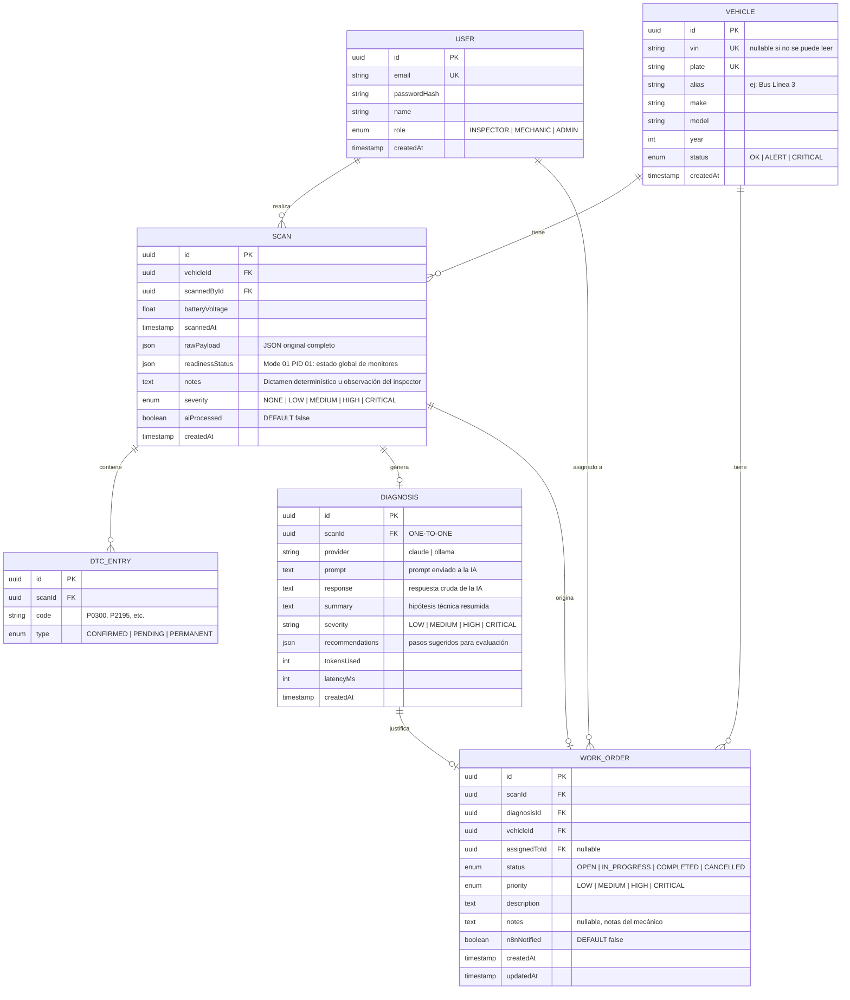
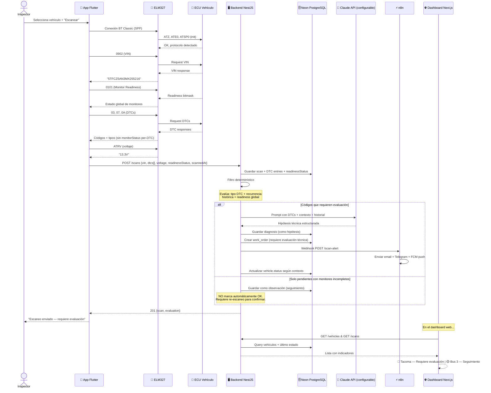
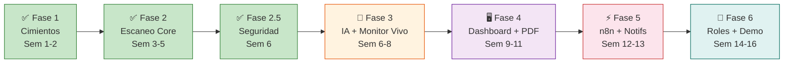

# Plan de Implementación — Plataforma de Diagnóstico Vehicular Preventivo OBD-II (UAGRM)

> **Alcance del entregable**: Sistema de diagnóstico vehicular preventivo mediante escaneos periódicos OBD-II, asistido por IA interpretativa. **NO incluye**: telemetría cloud continua (MQTT), IA predictiva por series temporales, uso sin conexión, ni soporte iOS.

---

## Stack Tecnológico con Versiones Fijadas

> [!IMPORTANT]
> Estas versiones fueron verificadas como compatibles entre sí en septiembre 2026. **No actualizar versiones mayores** a mitad del proyecto sin justificación.

| Componente            | Tecnología                                         | Versión                          | Notas                                                                      |
| --------------------- | -------------------------------------------------- | -------------------------------- | -------------------------------------------------------------------------- |
| **Runtime**           | Node.js                                            | **22 LTS**                       | Soportado explícitamente por NestJS 12                                     |
| **Backend**           | NestJS                                             | **12.x**                         | ESM-first, Standard Schema nativo                                          |
| **ORM**               | Prisma                                             | **6.19.x**                       | Schema-first, type-safe. Adaptador Neon para WebSocket/HTTPS               |
| **Base de datos**     | PostgreSQL 16                                      | **Neon** (cloud)                 | Conexión vía puerto **443** (WebSocket), compatible con redes restrictivas |
| **Frontend**          | Next.js                                            | **16.x**                         | App Router, React Server Components, Tailwind CSS v4                       |
| **Móvil**             | Flutter                                            | **3.35.3**                       | Pinned con **FVM**. **Solo Android** (API 21–35)                           |
| **BT Classic**        | flutter_bluetooth_serial_plus                      | **^0.5.6**                       | Fork mantenido, Android 12–15 compatible                                   |
| **Automatización**    | n8n                                                | **2.40.x**                       | Self-hosted via **Docker**                                                 |
| **IA interpretativa** | Claude API vía SDK oficial `@anthropic-ai/sdk`     | `AI_MODEL=claude-opus-5`         | Modelo configurable por `.env`. Respuesta tipada vía structured outputs     |
| **IA secundaria**     | Ollama (modelo local)                              | local                            | Demo de extensibilidad, no dependencia                                     |
| **Contenedores**      | Docker + Docker Compose                            | latest                           | Para n8n en desarrollo. BD en Neon                                         |

> [!WARNING]
> **iOS no está soportado.** Los adaptadores ELM327 genéricos usan Bluetooth Classic (SPP), que Apple restringe a dispositivos certificados MFi. Este proyecto es exclusivamente Android.

> [!NOTE]
> **Modelo de IA**: Se utiliza **Claude API (Anthropic)** como proveedor principal (`AI_PROVIDER=claude`), manteniendo el identificador del modelo (`AI_MODEL`) configurable en `.env` sin hardcodearlo.
>
> El modelo por defecto es **`claude-opus-5`** (la familia Claude 5 es la vigente; `claude-sonnet-5` es la alternativa más económica si el consumo de API resulta un problema). Se descartó el identificador `claude-sonnet-4-20250514` que figuraba en versiones previas de este plan: corresponde a un modelo de mayo 2025.
>
> La integración usa el **SDK oficial `@anthropic-ai/sdk`**, no llamadas REST manuales, y obtiene la respuesta ya validada contra un esquema mediante **structured outputs** (`output_config.format`). Esto elimina la tarea de "parsear la respuesta de la IA a mano", que era una fuente previsible de errores.

### Flutter — configuración específica

```bash
# Versión fijada en .fvmrc (3.35.3, coincidente con el SDK instalado)
fvm use 3.35.3 --force

# Todos los comandos flutter se ejecutan con fvm
fvm flutter pub get
fvm flutter run
```

Archivos a commitear: `.fvmrc`, `.vscode/settings.json`
En `.gitignore`: `.fvm/flutter_sdk`, `.fvm/cache`

---

## Alcance Definido vs. Documento Académico

> [!IMPORTANT]
> Esta tabla alinea los Requisitos Funcionales (RF) del documento de Taller de Grado con lo que efectivamente se implementará y demostrará.

| RF Doc.   | Descripción original                                 | Lo que se implementa                                                                                                                              | Estado         |
| --------- | ---------------------------------------------------- | ------------------------------------------------------------------------------------------------------------------------------------------------- | -------------- |
| RF01/RF02 | Roles: Admin, Mecánico, Conductor                    | Admin, Inspector, Mecánico. Autorización por **matriz de permisos** con `@RequirePermission()` (ver sección *Modelo de Autorización*)               | ✅ Ajustado    |
| RF05      | Lectura de DTCs vía OBD-II                           | Modos 03/07/0A + readiness global (Mode 01 PID 01)                                                                                                | ✅ Alineado    |
| RF06      | Telemetría: PIDs, gráficos, monitoreo en tiempo real | **Monitor en Vivo**: lectura local de PIDs (RPM, temp, velocidad) en pantalla del celular mientras está conectado. No hay streaming cloud ni MQTT | ✅ Redefinido  |
| RF07      | Conexión Bluetooth y lectura de fallas               | Flutter + `flutter_bluetooth_serial_plus` + ELM327                                                                                                | ✅ Alineado    |
| RF08      | Monitoreo en tiempo real con MQTT                    | **Eliminado**. Historial de escaneos con tendencias en dashboard web. No hay MQTT                                                                 | ⚠️ Reformulado |
| RF09      | IA predictiva (series temporales)                    | **Eliminado**. IA interpretativa: Claude API analiza DTCs ya detectados y genera hipótesis técnicas, NO predicciones                              | ⚠️ Reformulado |
| RF10      | Órdenes y alertas                                    | NestJS crea órdenes; n8n envía email + Telegram + FCM push                                                                                        | ✅ Alineado    |
| —         | Reportes PDF                                         | Exportar desde dashboard web (escaneos, diagnósticos, órdenes)                                                                                    | ✅ Nuevo       |
| —         | Incidencias en ruta                                  | **Fuera de alcance** (requiere vincular conductor↔vehículo↔turno)                                                                                 | ❌ No incluido |
| —         | Uso sin conexión                                     | **Fuera de alcance**                                                                                                                              | ❌ No incluido |
| —         | Respaldo S3                                          | Backup manual de Neon por el administrador, no es feature del sistema                                                                             | ❌ No incluido |
| —         | iOS                                                  | **Fuera de alcance** (BT Classic requiere MFi de Apple)                                                                                           | ❌ No incluido |

### Funcionalidades fuera de alcance (ampliaciones futuras)

- Telemetría continua cloud vía MQTT
- IA predictiva por series temporales (detectar tendencias _antes_ de la falla)
- Incidencias en ruta (registro de fallos mecánicos por el conductor)
- Uso sin conexión a internet
- Soporte iOS

---

## Modelo de Autorización

> [!IMPORTANT]
> Los roles definitivos dependen de una **entrevista pendiente con la institución** sobre cómo gestionan hoy el mantenimiento de su flota. Por eso el diseño no apuesta a acertar los nombres: apuesta a que cambiarlos sea barato.

### Dos decisiones que absorben el cambio

1. **Los guards no preguntan por el rol, preguntan por el permiso.** Los controladores declaran `@RequirePermission('order:close')`, nunca `@Roles('ADMIN')`. La correspondencia rol → permisos vive en una única matriz (`src/auth/permissions.ts`). Reasignar atribuciones tras la entrevista es editar una celda, no recorrer controladores.
2. **El nombre visible está separado del valor del enum.** `UserRole` es el identificador técnico estable; `ROLE_LABELS` contiene la etiqueta que ve el usuario. Si la institución llama "Encargado de Movilidades" a quien realiza los escaneos, se cambia un string y **no hay migración de base de datos**.

### Roles provisionales y matriz de permisos

| Permiso                | ADMIN | MECHANIC | INSPECTOR |
| ---------------------- | :---: | :------: | :-------: |
| `user:manage`          |   ✓   |          |           |
| `vehicle:read`         |   ✓   |    ✓     |     ✓     |
| `vehicle:write`        |   ✓   |          |           |
| `scan:read`            |   ✓   |    ✓     |     ✓     |
| `scan:create`          |   ✓   |    ✓     |     ✓     |
| `diagnosis:read`       |   ✓   |    ✓     |           |
| `order:read`           |   ✓   |    ✓     |           |
| `order:create`         |   ✓   |          |           |
| `order:assign`         |   ✓   |          |           |
| `order:update_status`  |   ✓   |    ✓     |           |
| **`order:close`**      |   ✓   |          |           |
| **`vehicle:authorize`**|   ✓   |          |           |
| `report:export`        |   ✓   |    ✓     |           |

> [!NOTE]
> **Separación de deberes.** El MECHANIC puede *avanzar* una orden (`order:update_status`: "en progreso", "trabajo realizado") pero **no cerrarla** ni **autorizar la operación del vehículo**. Esa decisión formal está reservada a un rol con responsabilidad institucional. Es la implementación literal del `[!CAUTION]` sobre validación humana que cierra este documento.

### Ampliación prevista: SUPERVISOR

Si la entrevista confirma que el encargado de flota es una persona distinta del administrador del sistema, se agrega `SUPERVISOR` al enum y una fila a la matriz con `order:close` + `vehicle:authorize`. **Ningún controlador cambia.** Es una migración aditiva (`ALTER TYPE ... ADD VALUE`), sin transformación de datos existentes.

### Cadena de autenticación



Principio: **cerrado por defecto**. Los guards están registrados globalmente con `APP_GUARD`; un endpoint nuevo queda protegido sin que el desarrollador tenga que recordar decorarlo. Solo `POST /auth/login` se abre explícitamente con `@Public()`.

---

## Estructura de Repositorios

```
Taller_sw/
├── contexto.md                  # Documento de contexto original
│
├── taller-backend/              # Repo independiente — NestJS + Prisma + Neon
│   ├── src/
│   │   ├── auth/                # Autenticación JWT + autorización
│   │   │   ├── permissions.ts   # Catálogo de permisos + matriz rol→permisos + labels
│   │   │   ├── decorators/      # @Public, @RequirePermission, @GetUser
│   │   │   └── guards/          # JwtAuthGuard + PermissionsGuard (globales)
│   │   ├── config/
│   │   │   └── env.validation.ts # Falla el arranque si falta/es débil JWT_SECRET
│   │   ├── vehicles/            # CRUD vehículos
│   │   ├── scans/               # Recepción, filtro determinístico y persistencia de escaneos
│   │   ├── diagnosis/           # Motor de diagnóstico (filtro + IA)
│   │   ├── work-orders/         # Órdenes de trabajo
│   │   ├── ai/                  # Provider interface + implementaciones
│   │   │   ├── ai.interface.ts
│   │   │   ├── claude.provider.ts
│   │   │   └── ollama.provider.ts
│   │   ├── n8n/                 # Webhooks para n8n
│   │   └── prisma/              # PrismaService con adapter Neon (WS/443)
│   ├── prisma/
│   │   ├── schema.prisma
│   │   ├── apply-migrations.ts  # Aplica migrations/ en orden (WebSocket/443)
│   │   ├── migrate.ts           # `npm run migrate:dev` — migra sin sembrar
│   │   ├── seed.ts
│   │   └── migrations/          # init → readiness_global → fix_cascade_deletes
│   ├── docker-compose.yml       # n8n para desarrollo
│   └── package.json
│
├── taller-frontend/             # Repo independiente — Next.js 16
│   ├── src/proxy.ts             # Protección de rutas en el borde (ex middleware.ts)
│   ├── src/app/
│   │   ├── login/               # Página de login
│   │   ├── dashboard/           # Dashboard principal + sub-rutas
│   │   │   ├── vehicles/        # Vistas de vehículos (CRUD conectado)
│   │   │   ├── scans/           # Vistas de escaneos + simulador rápido
│   │   │   └── work-orders/     # Vistas de órdenes de trabajo
│   │   └── layout.tsx
│   ├── src/components/          # Sidebar (menú por permisos), tablas, modales, PDF
│   ├── src/lib/
│   │   ├── api.ts               # Axios + interceptor JWT (401 cierra, 403 informa)
│   │   ├── auth.ts              # Sesión en cookie (legible por proxy.ts)
│   │   ├── auth-context.tsx     # Provider con user + permisos efectivos + can()
│   │   └── permissions.ts       # Espejo del catálogo del backend (solo para UI)
│   └── package.json
│
└── taller-mobile/               # Repo independiente — Flutter (Solo Android)
    ├── lib/
    │   ├── core/
    │   │   ├── auth/            # AuthService: sesión, permisos, restore/logout
    │   │   ├── bluetooth/       # Conexión BT Classic
    │   │   ├── elm327/          # Protocolo ELM327 (parser hex, queue, timeout)
    │   │   └── api/             # Cliente HTTP + login + ApiException (401/403)
    │   ├── features/
    │   │   ├── auth/            # Login + Cuenta (rol y permisos visibles)
    │   │   ├── scan/            # Pantalla de escaneo DTC
    │   │   ├── monitor/         # Pantalla de Monitor en Vivo (PIDs en tiempo real)
    │   │   ├── vehicles/        # Selección de vehículo
    │   │   └── history/         # Historial de escaneos
    │   ├── simulator/           # Modo demo multi-escenario sin hardware
    │   └── main.dart
    ├── .fvmrc
    └── pubspec.yaml
```

---

## Gestión de Migraciones

> [!IMPORTANT]
> Este proyecto **no usa `prisma migrate deploy`**. La cadena de conexión de Neon es la *pooled* (`-pooler`), sobre la que el CLI de Prisma no opera, y el SQL se aplica por WebSocket/443 — la misma razón por la que se eligió Neon. La tabla `_prisma_migrations` no existe.

Las migraciones viven en `prisma/migrations/` y las aplica `applyMigrations()` (`prisma/apply-migrations.ts`) en orden cronológico por nombre de carpeta.

| Comando                 | Qué hace                                                        |
| ----------------------- | --------------------------------------------------------------- |
| `npm run migrate:dev`   | Aplica solo las migraciones. **Seguro sobre una base con datos** |
| `npm run seed:dev`      | Aplica migraciones **y además** siembra datos de prueba          |

> [!WARNING]
> `seed:dev` inserta los escaneos con `create`, no con `upsert`: re-ejecutarlo sobre una base ya sembrada **duplica escaneos, diagnósticos y órdenes**. Para sincronizar el esquema de una base con datos reales, usar `migrate:dev`.

### Contrato de las migraciones

1. La migración inicial (`20260926000000_init`) se aplica **solo sobre una base vacía**.
2. Toda migración posterior **se ejecuta en cada corrida**, así que **debe ser idempotente**: `IF EXISTS` / `IF NOT EXISTS`, o `DROP CONSTRAINT IF EXISTS` seguido de `ADD CONSTRAINT`.
3. **Nunca se editan migraciones ya aplicadas.** Un cambio de esquema es una carpeta nueva.
4. Tras cambiar `schema.prisma`, verificar que la base coincide: las claves foráneas son el punto donde el drift pasa desapercibido más tiempo.

### Historial

| Migración                               | Contenido                                                                 |
| --------------------------------------- | ------------------------------------------------------------------------- |
| `20260926000000_init`                   | Esquema inicial (escrito a mano, de ahí el drift que corrigió la tercera) |
| `20260927000000_scan_readiness_global`  | `readinessStatus` global en `scans`; elimina `dtc_entries.monitorStatus` y el enum `MonitorStatus` |
| `20260928000000_fix_cascade_deletes`    | Alinea 5 FK con `onDelete: Cascade` del schema                            |

---

## Modelo de Base de Datos

> [!NOTE]
> **Corrección técnica aplicada**: `monitorStatus` (readiness de monitores OBD) es un dato **global por escaneo** obtenido del Mode 01 PID 01, NO un atributo per-DTC. Se almacena en `SCAN` como campo `readinessStatus` (JSON con el estado de cada monitor). El `DTC_ENTRY` solo tiene `code` y `type` (qué modo OBD lo reportó).



---

## Flujo End-to-End del Sistema

> [!IMPORTANT]
> **La IA genera hipótesis técnicas, NO diagnósticos confirmados.** La decisión formal sobre la operación del vehículo siempre queda en manos del responsable humano. El sistema es una herramienta de asistencia, no un sustituto del criterio técnico.



---

## Fases de Implementación

### Fase 1 — Cimientos (Semanas 1-2) ✅ COMPLETADA

**Objetivo:** Los 3 proyectos corriendo, base de datos conectada en Neon, esquema aplicado, datos de prueba cargados.

| Tarea                                                                                | Proyecto | Estado |
| ------------------------------------------------------------------------------------ | -------- | ------ |
| Scaffold NestJS 12 con Prisma + adapter Neon (WebSocket/443)                         | Backend  | ✅     |
| Schema Prisma completo + migración inicial aplicada en Neon                          | Backend  | ✅     |
| docker-compose.yml con n8n preparado                                                 | Backend  | ✅     |
| Módulo auth: registro + login + JWT + guard + roles decorator                        | Backend  | ✅     |
| Scaffold Next.js 16 con App Router, Tailwind v4, layout con sidebar                  | Frontend | ✅     |
| Scaffold Flutter 3.35.3 con FVM, estructura de carpetas, permisos BT                 | Mobile   | ✅     |
| API client base en frontend (axios + interceptor JWT) y mobile (http)                | Ambos    | ✅     |
| Seed de datos de prueba (usuarios, vehículos, escaneo Tacoma, diagnóstico, orden)    | Backend  | ✅     |
| Verificación: `nest build` ✅ `next build` ✅ `flutter analyze` ✅ `flutter test` ✅ | Todos    | ✅     |

---

### Fase 2 — Flujo de Escaneo Core (Semanas 3-5) ✅ COMPLETADA

**Objetivo:** Un escaneo viaja desde el teléfono hasta la base de datos con filtro determinístico correcto.

| Tarea                                                                               | Proyecto         | Estado |
| ----------------------------------------------------------------------------------- | ---------------- | ------ |
| CRUD completo de vehículos (endpoints + validación DTO)                             | Backend          | ✅ (`DELETE` corregido en Fase 2.5) |
| Endpoint `POST /scans` — recibe, valida, persiste scan + DTC entries                | Backend          | ✅     |
| Lectura de readiness global (Mode 01 PID 01) como campo `readinessStatus` en Scan   | Backend + Mobile | ✅     |
| Filtro determinístico de severidad (basado en tipo DTC + recurrencia + readiness)   | Backend          | ✅     |
| Detección de recurrencia (comparar con escaneos previos del mismo vehículo)         | Backend          | ✅     |
| Pruebas unitarias Jest para filtro determinístico (4/4 pasando)                     | Backend          | ✅     |
| Conexión BT Classic con `flutter_bluetooth_serial_plus`                             | Mobile           | ✅     |
| Servicio ELM327: init sequence, command queue, timeout, sincronización con `>`      | Mobile           | ✅     |
| Parser de respuestas: VIN (0902), DTCs (03/07/0A), readiness (0101), voltaje (ATRV) | Mobile           | ✅     |
| Pantalla de escaneo: selección vehículo → conectar → escanear → enviar              | Mobile           | ✅     |
| Modo simulador multi-escenario (`MockElm327`) con selector                          | Mobile           | ✅     |
| CRUD vehículos en web (lista + crear + editar + eliminar) y vista de escaneos       | Frontend         | ✅     |

**Demostrable al final:** La app (simulador o hardware real) escanea, envía el JSON al backend incluyendo readiness global, y los datos aparecen en la DB. La web muestra la lista de vehículos y el historial de escaneos con su dictamen determinístico.

---

### Fase 2.5 — Seguridad Transversal (Semana 6) ✅ COMPLETADA

> [!IMPORTANT]
> **Por qué esta fase existe.** En la versión original de este plan, la autenticación y el RBAC estaban en la Fase 6 (semanas 14-16). Una auditoría del código implementado mostró que esa postergación ya había producido deuda concreta: `POST /scans` estaba sin guard y atribuía los escaneos al primer usuario de la base (el administrador del seed), la app móvil leía un token que nada escribía, el dashboard web se renderizaba sin sesión, y `@Roles()` sin argumentos permitía el acceso en lugar de negarlo.
>
> Cerrar la autenticación a dos semanas de la defensa habría roto los tres proyectos a la vez. Es una preocupación transversal, no un pulido final.

**Objetivo:** Ningún dato de la flota es accesible sin sesión, y ningún escaneo existe sin autor identificado.

| Tarea                                                                                        | Proyecto | Estado |
| -------------------------------------------------------------------------------------------- | -------- | ------ |
| Catálogo de permisos + matriz rol→permisos + etiquetas visibles (`permissions.ts`)           | Backend  | ✅     |
| `JwtAuthGuard` y `PermissionsGuard` globales vía `APP_GUARD` — cerrado por defecto           | Backend  | ✅     |
| Decoradores `@Public()` y `@RequirePermission()`                                              | Backend  | ✅     |
| `RolesGuard` corregido para **fallar cerrado** (antes `@Roles()` vacío permitía el acceso)   | Backend  | ✅     |
| Validación de entorno al arrancar: sin `JWT_SECRET` fuerte el backend no inicia              | Backend  | ✅     |
| Eliminado el fallback a "usuario por defecto" en `POST /scans` (trazabilidad del autor)      | Backend  | ✅     |
| `POST /auth/register` deja de ser público: requiere `user:manage`                            | Backend  | ✅     |
| `GET /auth/me` devuelve rol, etiqueta y permisos efectivos para que la UI no duplique lógica | Backend  | ✅     |
| Permisos aplicados a vehicles, scans y work-orders                                            | Backend  | ✅     |
| Tests unitarios de la matriz de permisos (7 casos, separación de deberes incluida)            | Backend  | ✅     |
| Pantalla de login + `AuthService` + gate de sesión + pantalla de Cuenta                       | Mobile   | ✅     |
| `ApiException` con 401/403 diferenciados; 401 devuelve la app al login                        | Mobile   | ✅     |
| Configuración de URL del backend desde el login (emulador vs. dispositivo real)               | Mobile   | ✅     |
| Tests de regresión del gate de autenticación                                                  | Mobile   | ✅     |
| `proxy.ts`: protección de rutas en el borde (sesión en cookie, no en localStorage)            | Frontend | ✅     |
| `AuthProvider` + `can()`; menú y tarjetas del dashboard filtrados por permiso                 | Frontend | ✅     |
| Eliminado el `.catch(() => [])` que convertía errores de permisos en "0 vehículos"            | Frontend | ✅     |
| Migración `20260928000000_fix_cascade_deletes`: 5 FK alineadas con el schema                  | Backend  | ✅     |
| Migración `20260927000000_scan_readiness_global`: los `ALTER` sueltos del seed pasan a ser una migración con historial | Backend  | ✅     |
| `applyMigrations()` extraído a módulo propio + comando `npm run migrate:dev` (migrar sin sembrar) | Backend  | ✅     |
| `dotenv` declarado como dependencia (se importaba resolviendo por transitividad)              | Backend  | ✅     |

**Demostrable al final:** `/dashboard` sin sesión redirige a login. La app móvil exige credenciales antes de escanear y cada escaneo queda firmado por su autor real. Un INSPECTOR no ve la sección de órdenes de trabajo; un MECHANIC la ve pero no puede cerrarlas. El backend se niega a arrancar con un `JWT_SECRET` de ejemplo.

---

### Fase 3 — Motor de Diagnóstico IA + Monitor en Vivo (Semanas 6-8) ⏳ PENDIENTE

**Objetivo:** Los escaneos con códigos relevantes generan hipótesis técnicas en lenguaje natural con Claude API. El monitor en vivo muestra PIDs en tiempo real.

| Tarea                                                                                                                                                 | Proyecto | Estado |
| ----------------------------------------------------------------------------------------------------------------------------------------------------- | -------- | ------ |
| Interface `AiProvider` (método `diagnose()` con input/output tipado)                                                                                  | Backend  | ⏳     |
| Corregir `ai.interface.ts`: `DiagnosisInput` aún arrastra `monitorStatus` per-DTC (ver nota del modelo de datos)                                       | Backend  | ⏳     |
| Implementación `ClaudeProvider` con SDK `@anthropic-ai/sdk`, modelo configurable vía `AI_MODEL`                                                        | Backend  | ⏳     |
| Prompt engineering: estructura con DTCs + readiness + contexto vehículo + historial                                                                   | Backend  | ⏳     |
| **Prompt presenta resultados como hipótesis técnica**, no diagnóstico confirmado                                                                      | Backend  | ⏳     |
| Respuesta tipada con **structured outputs** (`output_config.format`) → objeto `Diagnosis`, sin parser manual                                            | Backend  | ⏳     |
| Manejo de fallos de la IA: timeout, error de API y cuota. El escaneo debe persistir aunque la IA falle                                                  | Backend  | ⏳     |
| Diccionario estático de DTCs comunes (capa determinística pre-IA)                                                                                     | Backend  | ✅ (adelantado en Fase 2) |
| Generación automática de `WorkOrder` cuando el filtro determina que requiere evaluación                                                               | Backend  | ⏳     |
| **Decidir deduplicación de órdenes**: `WorkOrder.scanId` es único, así que escaneos semanales del mismo fallo sin reparar generarían una orden nueva cada vez | Backend  | ⏳     |
| Endpoints de ciclo de vida de la orden: cambio de estado (`order:update_status`) y cierre (`order:close`)                                              | Backend  | ⏳     |
| Endpoints: `GET /scans/:id/diagnosis`, `GET /work-orders`                                                                                             | Backend  | ⏳     |
| Implementación `OllamaProvider` (misma interface, modelo local)                                                                                       | Backend  | ⏳     |
| **Monitor en Vivo**: pantalla Flutter que lee PIDs en loop (RPM, temp, velocidad, acelerador, voltaje) y muestra gauges/gráficos actualizados ~2-3 Hz | Mobile   | ⏳     |
| Respuestas del simulador para PIDs de monitor en vivo                                                                                                 | Mobile   | ✅ (adelantado en Fase 2) |

> [!NOTE]
> **Monitor en Vivo ≠ Telemetría Cloud.** Es lectura local en la pantalla del celular mientras está conectado al vehículo vía BT. Los datos NO se transmiten por MQTT ni se almacenan en streaming. Opcionalmente se puede guardar un snapshot al finalizar la sesión.

---

### Fase 4 — Dashboard Web Completo + Reportes PDF (Semanas 9-11) ⏳ PENDIENTE

**Objetivo:** El dashboard muestra el estado de la flota, diagnósticos, órdenes de trabajo y permite exportar reportes PDF.

| Tarea                                                                                    | Proyecto | Estado |
| ---------------------------------------------------------------------------------------- | -------- | ------ |
| Dashboard principal: cards por vehículo con indicador 🟢🟡🔴                             | Frontend | ✅ (base conectada en Fase 2) |
| Vista de vehículo: datos + historial de escaneos (tabla paginada)                        | Frontend | ⏳     |
| Vista de escaneo: códigos DTC + readiness + diagnóstico IA + severidad                   | Frontend | ✅ (base conectada en Fase 2) |
| Lista de órdenes de trabajo con filtros (estado, prioridad)                              | Frontend | ⏳     |
| Detalle de orden: diagnóstico asociado, cambio de estado, notas del mecánico             | Frontend | ⏳     |
| **Exportar a PDF**: reporte de escaneo individual, reporte de vehículo, reporte de orden | Frontend | ⏳     |
| Refinamiento de UI móvil: resultado del escaneo, feedback visual                         | Mobile   | ⏳     |
| Vistas y acciones condicionadas por permiso (reutiliza `can()` de la Fase 2.5)            | Frontend | ⏳     |
| Vista de historial en app (últimos escaneos del vehículo)                                | Mobile   | ✅ (adelantado en Fase 2) |

> [!NOTE]
> **Decisión de librería PDF**: `@react-pdf/renderer`. Se descarta `jsPDF` + `html2canvas` porque rasteriza la página (texto no seleccionable, archivos grandes, fuentes borrosas al imprimir) y se descarta la generación server-side con Puppeteer por el peso que agrega al backend. `@react-pdf/renderer` compone el reporte de forma declarativa y produce texto real, que es lo que se necesita para un anexo imprimible del informe de grado.

---

### Fase 5 — n8n + Notificaciones Multi-Canal (Semanas 12-13) ⏳ PENDIENTE

**Objetivo:** Cuando se crea una orden que requiere atención, n8n envía notificaciones por email, Telegram y push.

| Tarea                                                                            | Proyecto          | Estado |
| -------------------------------------------------------------------------------- | ----------------- | ------ |
| Endpoint webhook `POST /n8n/scan-alert` en backend                               | Backend           | ⏳     |
| Backend dispara HTTP POST a n8n cuando crea WorkOrder                            | Backend           | ⏳     |
| Flujo n8n: Webhook → Formatear mensaje → **Enviar email**                        | n8n               | ⏳     |
| Flujo n8n: Webhook → **Enviar mensaje a grupo/canal de Telegram**                | n8n               | ⏳     |
| **Firebase Cloud Messaging**: push notification a la app Android del responsable | Backend + Mobile  | ⏳     |
| (Opcional) Flujo n8n: resumen diario de órdenes abiertas                         | n8n               | ⏳     |
| Marcar `n8nNotified = true` en la orden después de notificar                     | Backend           | ⏳     |
| Indicador visual en web y app: "🔔 Notificación enviada"                         | Frontend + Mobile | ⏳     |

---

### Fase 6 — Roles, Pulido y Demo (Semanas 14-16) ⏳ PENDIENTE

**Objetivo:** Sistema listo para la defensa.

| Tarea                                                             | Proyecto | Estado |
| ----------------------------------------------------------------- | -------- | ------ |
| RBAC con guards activos                                           | Backend  | ✅ (movido a Fase 2.5) |
| Menú y vistas condicionales por rol en web                        | Frontend | ✅ (base en Fase 2.5) |
| Ajustar la matriz de permisos con los roles reales de la institución (tras la entrevista) | Backend  | ⏳     |
| Pruebas end-to-end con hardware real (2-3 vehículos)              | Mobile   | ⏳     |
| Corregir el parser DTC para protocolos no-CAN y el readiness diésel (ver *Deuda Técnica*) | Mobile   | ⏳     |
| Refinamiento de prompts de IA con datos reales                    | Backend  | ⏳     |
| Manejo de errores y edge cases (timeout BT, error de red, etc.)   | Mobile   | ⏳     |
| UI polish: loading states, empty states, responsive               | Frontend | ⏳     |
| Documentación: README de cada repo, guía de instalación           | Todos    | ⏳     |
| Preparación del script de demo para la defensa                    | Docs     | ⏳     |

---

## Diagrama de Fases (Timeline)



---

## Plan de Verificación

| Fase | Verificación                                                                                                                                                       |
| ---- | ------------------------------------------------------------------------------------------------------------------------------------------------------------------ |
| 1 ✅ | `nest build` compila. `next build` compila. `flutter analyze` sin errores. Login funciona. Neon con tablas y seed                                                  |
| 2 ✅ | Escaneo simulado desde Flutter llega al backend y se persiste con readiness global. `GET /vehicles/:id/scans` devuelve historial. Tests Jest y Flutter pasando     |
| 2.5 ✅ | `curl` sin token a `/api/vehicles`, `/api/scans` y `/api/work-orders` devuelve 401. `/dashboard` sin cookie redirige a login. La app móvil no permite escanear sin sesión y el escaneo queda firmado por el autor real. Login como `mecanico@` no muestra acciones de cierre de orden. El backend no arranca con `JWT_SECRET` vacío o de ejemplo. `DELETE /vehicles/:id` devuelve 200 y borra en cascada sus escaneos y DTCs (drift de FK: 0 de 8). `nest build` ✅ · Jest 11/11 ✅ · `next build` ✅ · `flutter analyze` sin issues ✅ · `flutter test` 4/4 ✅ |
| 3    | `POST /scans` con DTCs relevantes genera hypothesis + work order con Claude API. Monitor en Vivo muestra RPM y temp en tiempo real (simulador y hardware)          |
| 4    | Dashboard completo navegable. Datos reales visibles. Exportar PDF funciona. Responsive en desktop                                                                  |
| 5    | Flujo completo: scan → hypothesis → work order → email + Telegram + push notification. Log de n8n muestra ejecución exitosa                                        |
| 6    | Login con diferentes roles muestra vistas distintas. Demo completa con vehículo real sin fallos. Reportes PDF generados                                            |

---

## Deuda Técnica Conocida

> [!WARNING]
> Hallazgos de la auditoría de código de septiembre 2026. Se documentan acá para que no se descubran durante la defensa. Los dos primeros solo se manifiestan con **hardware real**, así que conviene corregirlos mientras todavía se puede probar contra el simulador.

| # | Hallazgo | Dónde | Impacto | Se corrige en |
| - | -------- | ----- | ------- | ------------- |
| 1 | ~~La migración aplicada no coincide con el schema: 5 FK creadas con `ON DELETE RESTRICT` donde `schema.prisma` declara `onDelete: Cascade`~~ | `migration.sql` escrito a mano | `DELETE /vehicles/:id` devolvía **500** (`P2003`) para cualquier vehículo con escaneos | ✅ **RESUELTO** — migración `20260928000000_fix_cascade_deletes`, drift verificado en 0/8 FK |
| 2 | El parser de DTCs asume el byte de conteo de **ISO 15765-4 (CAN)**. En ISO 9141-2 / KWP2000 ese byte no existe, así que se pierde el primer código y se desalinea el resto | `elm327_service.dart` → `parseDtcs()` | Vehículos anteriores a ~2008 devuelven códigos incorrectos. Como se usa `ATSP0` (autodetección), ambos protocolos aparecerán en una flota real | Fase 6 |
| 3 | El readiness mapea el byte D como si el motor fuera siempre de **encendido por chispa**. No se lee el bit de encendido por compresión del byte B | `elm327_service.dart` → `parseReadiness()` | En un bus **diésel** se reportaría "Sistema EVAP incompleto" en un vehículo que no tiene sistema EVAP. El caso de uso central del proyecto es justamente un bus | Fase 6 |
| 4 | `vehicle.status` se sobrescribe con el resultado del último escaneo, sin considerar órdenes abiertas | `scans.service.ts` → `create()` | Un escaneo limpio devuelve a 🟢 OK un vehículo con una orden crítica sin reparar (p. ej. tras borrar códigos o desconectar la batería) | Fase 3 |
| 5 | La recurrencia se calcula contra **un solo** escaneo previo (`findFirst`) | `scans.service.ts` → `create()` | Un patrón intermitente que aparece en los escaneos 1 y 3 no se detecta; y dos escaneos seguidos el mismo día se marcan como "recurrencia histórica" y escalan a CRÍTICO | Fase 3 |
| 6 | `docker-compose.yml` levanta Postgres con la base `taller_obd`, pero n8n apunta a una base `n8n` que nadie crea | `docker-compose.yml` | n8n no arranca con persistencia Postgres. Además contradice "la BD está en Neon" | Fase 5 |
| 7 | `taller-mobile` no tiene `.gitignore` | repo móvil | Hoy el repo está limpio, pero el primer `flutter build apk` empieza a versionar artefactos | Cuando sea |
| 8 | `PrismaService` detecta Neon con `connectionString.includes('neon.tech')` | `prisma.service.ts` | Frágil ante cambios de host; conviene una variable de entorno explícita | Cuando sea |
| 9 | `ReadinessStatusDto` marca campos con `@IsOptional()` sin validador de tipo | `create-scan.dto.ts` | `milOn: "banana"` pasa la validación y se persiste | Fase 3 |

---

## Notas sobre Diagnóstico IA

> [!CAUTION]
> **Validación humana obligatoria.** El sistema presenta las recomendaciones de la IA como _hipótesis técnicas a evaluar por un profesional_, nunca como diagnósticos confirmados. Un código permanente (Mode 0A) puede permanecer almacenado después de una reparación mientras la ECU completa sus ciclos de verificación; por sí solo NO demuestra que la falla esté activa. La decisión de autorizar o no la operación de un vehículo es siempre responsabilidad del evaluador humano.
