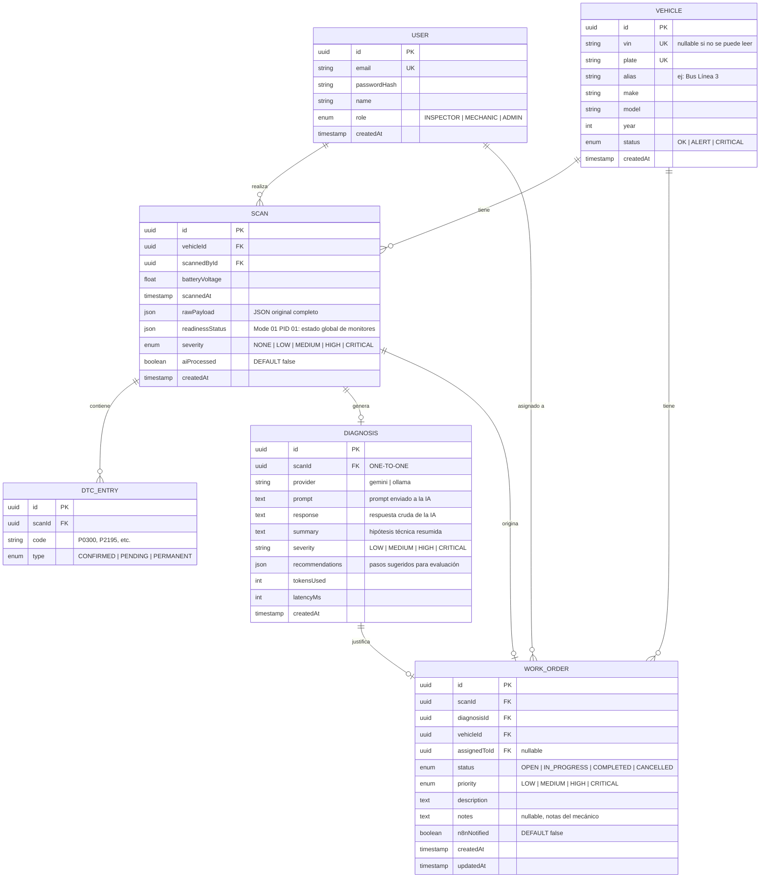
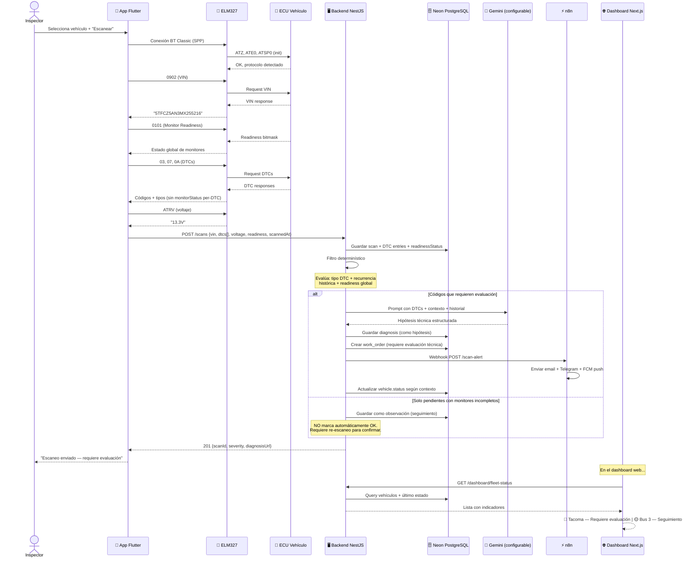
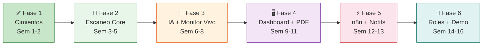

# Plan de Implementación — Plataforma de Diagnóstico Vehicular Preventivo OBD-II (UAGRM)

> **Alcance del entregable**: Sistema de diagnóstico vehicular preventivo mediante escaneos periódicos OBD-II, asistido por IA interpretativa. **NO incluye**: telemetría cloud continua (MQTT), IA predictiva por series temporales, uso sin conexión, ni soporte iOS.

---

## Stack Tecnológico con Versiones Fijadas

> [!IMPORTANT]
> Estas versiones fueron verificadas como compatibles entre sí en septiembre 2026. **No actualizar versiones mayores** a mitad del proyecto sin justificación.

| Componente            | Tecnología                    | Versión                     | Notas                                                                      |
| --------------------- | ----------------------------- | --------------------------- | -------------------------------------------------------------------------- |
| **Runtime**           | Node.js                       | **22 LTS**                  | Soportado explícitamente por NestJS 12                                     |
| **Backend**           | NestJS                        | **12.x**                    | ESM-first, Standard Schema nativo                                          |
| **ORM**               | Prisma                        | **6.19.x**                  | Schema-first, type-safe. Adaptador Neon para WebSocket/HTTPS               |
| **Base de datos**     | PostgreSQL 16                 | **Neon** (cloud)            | Conexión vía puerto **443** (WebSocket), compatible con redes restrictivas |
| **Frontend**          | Next.js                       | **16.x**                    | App Router, React Server Components, Tailwind CSS v4                       |
| **Móvil**             | Flutter                       | **3.35.3**                  | Pinned con **FVM**. **Solo Android** (API 21–35)                           |
| **BT Classic**        | flutter_bluetooth_serial_plus | **^0.5.6**                  | Fork mantenido, Android 12–15 compatible                                   |
| **Automatización**    | n8n                           | **2.40.x**                  | Self-hosted via **Docker**                                                 |
| **IA interpretativa** | Configurable vía `.env`       | `AI_MODEL=gemini-2.0-flash` | Modelo configurable. Verificar disponibilidad y cuotas al implementar      |
| **IA secundaria**     | Ollama (modelo local)         | local                       | Demo de extensibilidad, no dependencia                                     |
| **Contenedores**      | Docker + Docker Compose       | latest                      | Para n8n en desarrollo. BD en Neon                                         |

> [!WARNING]
> **iOS no está soportado.** Los adaptadores ELM327 genéricos usan Bluetooth Classic (SPP), que Apple restringe a dispositivos certificados MFi. Este proyecto es exclusivamente Android.

> [!NOTE]
> **Modelo de IA**: El identificador del modelo (`AI_MODEL`) se configura en `.env` y NO se hardcodea. Google descontinúa modelos periódicamente (ej: `gemini-1.5-flash` dejó de funcionar el 29/09/2025). Las cuotas gratuitas tampoco están garantizadas; verificar al momento de implementar.

### Flutter — configuración específica

```bash
# Versión fijada en .fvmrc (3.35.3, coincidente con el SDK instalado)
fvm use 3.35.3 --force

# Todos los comandos flutter se ejecutan con fvm
fvm flutter pub get
fvm flutter run
```

Archivos a commitear: `.fvmrc`, `.vscode/settings.json`
En `.gitignore`: `.fvm/flutter_sdk`, `.fvm/cache`

---

## Alcance Definido vs. Documento Académico

> [!IMPORTANT]
> Esta tabla alinea los Requisitos Funcionales (RF) del documento de Taller de Grado con lo que efectivamente se implementará y demostrará.

| RF Doc.   | Descripción original                                 | Lo que se implementa                                                                                                                              | Estado         |
| --------- | ---------------------------------------------------- | ------------------------------------------------------------------------------------------------------------------------------------------------- | -------------- |
| RF01/RF02 | Roles: Admin, Mecánico, Conductor                    | Admin, Inspector, Mecánico. Guards con `@Roles()`                                                                                                 | ✅ Ajustado    |
| RF05      | Lectura de DTCs vía OBD-II                           | Modos 03/07/0A + readiness global (Mode 01 PID 01)                                                                                                | ✅ Alineado    |
| RF06      | Telemetría: PIDs, gráficos, monitoreo en tiempo real | **Monitor en Vivo**: lectura local de PIDs (RPM, temp, velocidad) en pantalla del celular mientras está conectado. No hay streaming cloud ni MQTT | ✅ Redefinido  |
| RF07      | Conexión Bluetooth y lectura de fallas               | Flutter + `flutter_bluetooth_serial_plus` + ELM327                                                                                                | ✅ Alineado    |
| RF08      | Monitoreo en tiempo real con MQTT                    | **Eliminado**. Historial de escaneos con tendencias en dashboard web. No hay MQTT                                                                 | ⚠️ Reformulado |
| RF09      | IA predictiva (series temporales)                    | **Eliminado**. IA interpretativa: Gemini analiza DTCs ya detectados y genera hipótesis técnicas, NO predicciones                                  | ⚠️ Reformulado |
| RF10      | Órdenes y alertas                                    | NestJS crea órdenes; n8n envía email + Telegram + FCM push                                                                                        | ✅ Alineado    |
| —         | Reportes PDF                                         | Exportar desde dashboard web (escaneos, diagnósticos, órdenes)                                                                                    | ✅ Nuevo       |
| —         | Incidencias en ruta                                  | **Fuera de alcance** (requiere vincular conductor↔vehículo↔turno)                                                                                 | ❌ No incluido |
| —         | Uso sin conexión                                     | **Fuera de alcance**                                                                                                                              | ❌ No incluido |
| —         | Respaldo S3                                          | Backup manual de Neon por el administrador, no es feature del sistema                                                                             | ❌ No incluido |
| —         | iOS                                                  | **Fuera de alcance** (BT Classic requiere MFi de Apple)                                                                                           | ❌ No incluido |

### Funcionalidades fuera de alcance (ampliaciones futuras)

- Telemetría continua cloud vía MQTT
- IA predictiva por series temporales (detectar tendencias _antes_ de la falla)
- Incidencias en ruta (registro de fallos mecánicos por el conductor)
- Uso sin conexión a internet
- Soporte iOS

---

## Estructura de Repositorios

```
Taller_sw/
├── contexto.md                  # Documento de contexto original
│
├── taller-backend/              # Repo independiente — NestJS + Prisma + Neon
│   ├── src/
│   │   ├── auth/                # Módulo de autenticación JWT
│   │   ├── vehicles/            # CRUD vehículos
│   │   ├── scans/               # Recepción y procesamiento de escaneos
│   │   ├── diagnosis/           # Motor de diagnóstico (filtro + IA)
│   │   ├── work-orders/         # Órdenes de trabajo
│   │   ├── ai/                  # Provider interface + implementaciones
│   │   │   ├── ai.interface.ts
│   │   │   ├── gemini.provider.ts
│   │   │   └── ollama.provider.ts
│   │   ├── n8n/                 # Webhooks para n8n
│   │   └── prisma/              # PrismaService con adapter Neon (WS/443)
│   ├── prisma/
│   │   ├── schema.prisma
│   │   ├── seed.ts
│   │   └── migrations/
│   ├── docker-compose.yml       # n8n para desarrollo
│   └── package.json
│
├── taller-frontend/             # Repo independiente — Next.js 16
│   ├── src/app/
│   │   ├── login/               # Página de login
│   │   ├── dashboard/           # Dashboard principal + sub-rutas
│   │   │   ├── vehicles/        # Vistas de vehículos
│   │   │   ├── scans/           # Vistas de escaneos + diagnósticos
│   │   │   └── work-orders/     # Vistas de órdenes de trabajo
│   │   └── layout.tsx
│   ├── src/components/          # Sidebar, tablas, modales, PDF export
│   ├── src/lib/                 # API client, auth, utils
│   └── package.json
│
└── taller-mobile/               # Repo independiente — Flutter (Solo Android)
    ├── lib/
    │   ├── core/
    │   │   ├── bluetooth/       # Conexión BT Classic
    │   │   ├── elm327/          # Protocolo ELM327 (parser, queue, timeout)
    │   │   └── api/             # Cliente HTTP al backend
    │   ├── features/
    │   │   ├── scan/            # Pantalla de escaneo DTC
    │   │   ├── monitor/         # Pantalla de Monitor en Vivo (PIDs en tiempo real)
    │   │   ├── vehicles/        # Selección de vehículo
    │   │   └── history/         # Historial de escaneos
    │   ├── simulator/           # Modo demo sin hardware
    │   └── main.dart
    ├── .fvmrc
    └── pubspec.yaml
```

---

## Modelo de Base de Datos

> [!NOTE]
> **Corrección técnica**: `monitorStatus` (readiness de monitores OBD) es un dato **global por escaneo** obtenido del Mode 01 PID 01, NO un atributo per-DTC. Se mueve de `DTC_ENTRY` a `SCAN` como campo `readinessStatus` (JSON con el estado de cada monitor). El `DTC_ENTRY` solo tiene `code` y `type` (qué modo OBD lo reportó).



---

## Flujo End-to-End del Sistema

> [!IMPORTANT]
> **La IA genera hipótesis técnicas, NO diagnósticos confirmados.** La decisión formal sobre la operación del vehículo siempre queda en manos del responsable humano. El sistema es una herramienta de asistencia, no un sustituto del criterio técnico.



---

## Modo Simulador (desarrollo sin hardware)

Para no depender del ELM327 + un vehículo físico en cada sesión de desarrollo:

### En Flutter — "Demo Mode"

La app tendrá un toggle en settings que reemplaza la comunicación BT real con respuestas predefinidas:

```dart
// simulator/mock_elm327.dart
class MockElm327 {
  static const Map<String, String> responses = {
    'ATZ':  'ELM327 v2.1\r\r>',
    'ATE0': 'OK\r\r>',
    'ATSP0': 'OK\r\r>',
    'ATRV': '13.3V\r\r>',
    '0101': '41 01 82 07 65 04\r\r>',             // Readiness: 2 monitors incomplete
    '0902': '49 02 01 35 54 46 43 5A 35 41 4E 33 4D 58 32 35 35 32 31 36\r\r>',
    '03':   '43 02 03 00 03 01\r\r>',              // P0300 + P0301 confirmed
    '07':   '47 01 21 95\r\r>',                     // P2195 pending
    '0A':   '4A 02 03 00 03 01\r\r>',               // P0300 + P0301 permanent
    // PIDs para Monitor en Vivo
    '010C': '41 0C 1A F8\r\r>',                     // RPM: ~1726
    '010D': '41 0D 00\r\r>',                        // Velocidad: 0 km/h (ralentí)
    '0105': '41 05 7B\r\r>',                        // Temp refrigerante: 83°C
    '0111': '41 11 1A\r\r>',                        // Acelerador: ~10%
    '0142': '41 42 34 2E\r\r>',                     // Voltaje: 13.4V
  };

  String send(String command) {
    return responses[command.trim().toUpperCase()] ?? 'NO DATA\r\r>';
  }
}
```

### En Backend — Seed Data

```bash
# Comando para sembrar datos de prueba (usa Neon vía puerto 443)
npm run seed:dev
```

---

## Fases de Implementación

### Fase 1 — Cimientos (Semanas 1-2) ✅ COMPLETADA

**Objetivo:** Los 3 proyectos corriendo, base de datos conectada en Neon, esquema aplicado, datos de prueba cargados.

| Tarea                                                                                | Estado |
| ------------------------------------------------------------------------------------ | ------ |
| Scaffold NestJS 12 con Prisma + adapter Neon (WebSocket/443)                         | ✅     |
| Schema Prisma completo + migración inicial aplicada en Neon                          | ✅     |
| docker-compose.yml con n8n preparado                                                 | ✅     |
| Módulo auth: registro + login + JWT + guard + roles decorator                        | ✅     |
| Scaffold Next.js 16 con App Router, Tailwind v4, layout con sidebar                  | ✅     |
| Scaffold Flutter 3.35.3 con FVM, estructura de carpetas, permisos BT                 | ✅     |
| API client base en frontend (axios + interceptor JWT) y mobile (http)                | ✅     |
| Seed de datos de prueba (usuarios, vehículos, escaneo Tacoma, diagnóstico, orden)    | ✅     |
| Verificación: `nest build` ✅ `next build` ✅ `flutter analyze` ✅ `flutter test` ✅ | ✅     |

---

### Fase 2 — Flujo de Escaneo Core (Semanas 3-5)

**Objetivo:** Un escaneo viaja desde el teléfono hasta la base de datos con filtro determinístico correcto.

| Tarea                                                                               | Proyecto         |
| ----------------------------------------------------------------------------------- | ---------------- |
| CRUD completo de vehículos (endpoints + validación DTO)                             | Backend          |
| Endpoint `POST /scans` — recibe, valida, persiste scan + DTC entries                | Backend          |
| Lectura de readiness global (Mode 01 PID 01) como campo `readinessStatus` en Scan   | Backend + Mobile |
| Filtro determinístico de severidad (basado en tipo DTC + recurrencia + readiness)   | Backend          |
| Detección de recurrencia (comparar con escaneos previos del mismo vehículo)         | Backend          |
| Conexión BT Classic con `flutter_bluetooth_serial_plus`                             | Mobile           |
| Servicio ELM327: init sequence, command queue, timeout, retry                       | Mobile           |
| Parser de respuestas: VIN (0902), DTCs (03/07/0A), readiness (0101), voltaje (ATRV) | Mobile           |
| Pantalla de escaneo: selección vehículo → conectar → escanear → enviar              | Mobile           |
| Modo simulador (MockElm327) con toggle                                              | Mobile           |
| CRUD vehículos en web (lista + crear + editar)                                      | Frontend         |

**Demostrable al final:** La app (simulador o hardware real) escanea, envía el JSON al backend incluyendo readiness global, y los datos aparecen en la DB. La web muestra la lista de vehículos.

---

### Fase 3 — Motor de Diagnóstico IA + Monitor en Vivo (Semanas 6-8)

**Objetivo:** Los escaneos con códigos relevantes generan hipótesis técnicas en lenguaje natural. El monitor en vivo muestra PIDs en tiempo real.

| Tarea                                                                                                                                                 | Proyecto |
| ----------------------------------------------------------------------------------------------------------------------------------------------------- | -------- |
| Interface `AiProvider` (método `diagnose()` con input/output tipado)                                                                                  | Backend  |
| Implementación `GeminiProvider` — API REST, modelo configurable vía `AI_MODEL` env                                                                    | Backend  |
| Prompt engineering: estructura con DTCs + readiness + contexto vehículo + historial                                                                   | Backend  |
| **Prompt presenta resultados como hipótesis técnica**, no diagnóstico confirmado                                                                      | Backend  |
| Parser de respuesta IA → objeto `Diagnosis` estructurado                                                                                              | Backend  |
| Diccionario estático de DTCs comunes (capa determinística pre-IA)                                                                                     | Backend  |
| Generación de `WorkOrder` cuando el filtro determina que requiere evaluación                                                                          | Backend  |
| Endpoints: `GET /scans/:id/diagnosis`, `GET /work-orders`                                                                                             | Backend  |
| Implementación `OllamaProvider` (misma interface, modelo local)                                                                                       | Backend  |
| **Monitor en Vivo**: pantalla Flutter que lee PIDs en loop (RPM, temp, velocidad, acelerador, voltaje) y muestra gauges/gráficos actualizados ~2-3 Hz | Mobile   |
| Respuestas del simulador para PIDs de monitor en vivo                                                                                                 | Mobile   |

> [!NOTE]
> **Monitor en Vivo ≠ Telemetría Cloud.** Es lectura local en la pantalla del celular mientras está conectado al vehículo vía BT. Los datos NO se transmiten por MQTT ni se almacenan en streaming. Opcionalmente se puede guardar un snapshot al finalizar la sesión.

**Demostrable al final:** Un escaneo con P0300+P0301 genera una hipótesis como: _"Posible fallo de encendido en cilindro 1. Severidad: ALTA. Sugerencias a evaluar por un técnico: inspeccionar bujías, cables y bobina del cilindro 1."_ Se crea una orden de trabajo para evaluación. El monitor en vivo muestra RPM y temperatura en tiempo real.

---

### Fase 4 — Dashboard Web Completo + Reportes PDF (Semanas 9-11)

**Objetivo:** El dashboard muestra el estado de la flota, diagnósticos, órdenes de trabajo y permite exportar reportes PDF.

| Tarea                                                                                    | Proyecto |
| ---------------------------------------------------------------------------------------- | -------- |
| Dashboard principal: cards por vehículo con indicador 🟢🟡🔴                             | Frontend |
| Vista de vehículo: datos + historial de escaneos (tabla paginada)                        | Frontend |
| Vista de escaneo: códigos DTC + readiness + diagnóstico IA + severidad                   | Frontend |
| Lista de órdenes de trabajo con filtros (estado, prioridad)                              | Frontend |
| Detalle de orden: diagnóstico asociado, cambio de estado, notas del mecánico             | Frontend |
| **Exportar a PDF**: reporte de escaneo individual, reporte de vehículo, reporte de orden | Frontend |
| Refinamiento de UI móvil: resultado del escaneo, feedback visual                         | Mobile   |
| Vista de historial en app (últimos escaneos del vehículo)                                | Mobile   |

**Demostrable al final:** Dashboard web completo navegable. Se puede ver la flota, entrar a un vehículo, ver sus escaneos, leer la hipótesis de IA, gestionar órdenes de trabajo y exportar reportes PDF.

---

### Fase 5 — n8n + Notificaciones Multi-Canal (Semanas 12-13)

**Objetivo:** Cuando se crea una orden que requiere atención, n8n envía notificaciones por email, Telegram y push.

| Tarea                                                                            | Proyecto          |
| -------------------------------------------------------------------------------- | ----------------- |
| Endpoint webhook `POST /n8n/scan-alert` en backend                               | Backend           |
| Backend dispara HTTP POST a n8n cuando crea WorkOrder                            | Backend           |
| Flujo n8n: Webhook → Formatear mensaje → **Enviar email**                        | n8n               |
| Flujo n8n: Webhook → **Enviar mensaje a grupo/canal de Telegram**                | n8n               |
| **Firebase Cloud Messaging**: push notification a la app Android del responsable | Backend + Mobile  |
| (Opcional) Flujo n8n: resumen diario de órdenes abiertas                         | n8n               |
| Marcar `n8nNotified = true` en la orden después de notificar                     | Backend           |
| Indicador visual en web y app: "🔔 Notificación enviada"                         | Frontend + Mobile |

**Demostrable al final:** Se escanea un vehículo con falla relevante → se crea hipótesis + orden → n8n envía email + mensaje a Telegram → la app recibe push notification → el dashboard muestra todo el flujo.

---

### Fase 6 — Roles, Pulido y Demo (Semanas 14-16)

**Objetivo:** Sistema listo para la defensa.

| Tarea                                                             | Proyecto |
| ----------------------------------------------------------------- | -------- |
| RBAC: roles `INSPECTOR` / `MECHANIC` / `ADMIN` con guards activos | Backend  |
| Menú y vistas condicionales por rol en web                        | Frontend |
| Pruebas end-to-end con hardware real (2-3 vehículos)              | Mobile   |
| Refinamiento de prompts de IA con datos reales                    | Backend  |
| Manejo de errores y edge cases (timeout BT, error de red, etc.)   | Mobile   |
| UI polish: loading states, empty states, responsive               | Frontend |
| Documentación: README de cada repo, guía de instalación           | Todos    |
| Preparación del script de demo para la defensa                    | Docs     |

**Demostrable al final:** Sistema completo funcionando de punta a punta con datos reales. Roles diferenciados. Demo fluida. Reportes PDF. Notificaciones multi-canal.

---

## Diagrama de Fases (Timeline)



---

## Plan de Verificación

### Por fase

| Fase | Verificación                                                                                                                                                       |
| ---- | ------------------------------------------------------------------------------------------------------------------------------------------------------------------ |
| 1 ✅ | `nest build` compila. `next build` compila. `flutter analyze` sin errores. Login funciona. Neon con tablas y seed                                                  |
| 2    | Escaneo simulado desde Flutter llega al backend y se persiste con readiness global. `GET /vehicles/:id/scans` devuelve historial. Escaneo real con ELM327 funciona |
| 3    | `POST /scans` con DTCs relevantes genera hypothesis + work order. Monitor en Vivo muestra RPM y temp en tiempo real (simulador y hardware)                         |
| 4    | Dashboard completo navegable. Datos reales visibles. Exportar PDF funciona. Responsive en desktop                                                                  |
| 5    | Flujo completo: scan → hypothesis → work order → email + Telegram + push notification. Log de n8n muestra ejecución exitosa                                        |
| 6    | Login con diferentes roles muestra vistas distintas. Demo completa con vehículo real sin fallos. Reportes PDF generados                                            |

### Testing continuo

- **Backend**: tests unitarios con Jest para el filtro determinístico y el parser de DTCs
- **Mobile**: test manual con simulador en cada feature nueva + test con hardware cada 2 semanas
- **Frontend**: verificación visual manual + Lighthouse básico

---

## Notas sobre Arquitectura para Roles (preparación)

> [!TIP]
> Aunque los roles se implementan en la Fase 6, la arquitectura los soporta desde la Fase 1.

El campo `role` en la tabla `USER` ya existe desde el schema inicial con default `'INSPECTOR'`. Los guards de NestJS se diseñan desde el inicio con un `@Roles()` decorator vacío que no restringe nada hasta la Fase 6:

```typescript
// Desde Fase 1 — no restringe nada, pero el decorator ya existe
@Roles() // Sin argumentos = cualquier rol autenticado puede acceder
@Get('vehicles')
findAll() { ... }

// En Fase 6 — se activan las restricciones
@Roles('ADMIN', 'INSPECTOR')
@Get('vehicles')
findAll() { ... }

@Roles('ADMIN', 'MECHANIC')
@Patch('work-orders/:id')
update() { ... }
```

---

## Notas sobre Diagnóstico IA

> [!CAUTION]
> **Validación humana obligatoria.** El sistema presenta las recomendaciones de la IA como _hipótesis técnicas a evaluar por un profesional_, nunca como diagnósticos confirmados. Un código permanente (Mode 0A) puede permanecer almacenado después de una reparación mientras la ECU completa sus ciclos de verificación; por sí solo NO demuestra que la falla esté activa. La decisión de autorizar o no la operación de un vehículo es siempre responsabilidad del evaluador humano.

### Reglas del filtro determinístico (pre-IA)

1. **Si hay DTCs tipo `CONFIRMED` (Mode 03)**: Se marca como `requiere evaluación` y se envía a la IA para hipótesis.
2. **Si hay DTCs tipo `PERMANENT` (Mode 0A)**: Se evalúa en conjunto con la readiness global y el historial. Un `PERMANENT` **con monitores completados y recurrencia** es señal fuerte. Un `PERMANENT` **con monitores incompletos** puede ser residual post-reparación.
3. **Si solo hay DTCs `PENDING` (Mode 07) con monitores incompletos**: Se registra como observación de seguimiento. **No se marca automáticamente como OK ni como falla**; requiere re-escaneo para confirmar si el código desaparece o se confirma.
4. **Si no hay DTCs**: Se marca como `OK` (sin códigos reportados por la ECU).

### Datos que la app captura en cada escaneo

- VIN (Mode 09 PID 02)
- DTCs confirmados (Mode 03)
- DTCs pendientes (Mode 07)
- DTCs permanentes (Mode 0A)
- Readiness de monitores (Mode 01 PID 01) — dato **global**, no per-DTC
- Voltaje de batería (AT RV)
- Timestamp del escaneo
